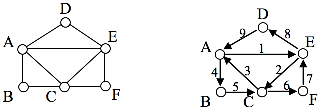
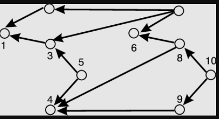
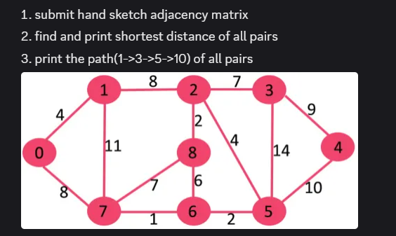

# CSM2121 Data Structures Class Works

## Arrays & Strings

Write an algorithm for any sub string matching 

[✔️] exact 100% 

[✔️] 1, 2, 3, ... , n character don't care

[✔️] 10%, 15%,..... any percent don't care

## Linked List

✔️ Apply basic linked list operations in any language (sort, unique, reverse, etc)

✔️ Create a list with random 1 billion data

## Stacks and Queues

✔️ implement stack and queue using array and STL 

✔️ check imbalance parameters with 1 crore data

✔️ calculate the value of an expression e.g. (4+5)/2/3. Check with at least 50 values

## Graph

✔️ Generate a graph for matching your name (submit hand sketch design)

✔️ Solve UVA 10735

✔️ submit code and graph for this given graph

✔️ You are given this graph

 
    
Find the number of degree of each node, number of edges, in degree and out degree of each node, hand-sketch calculation for this, code or output.

✔️ solve UVA 775, apply dirac's theorem on the graph of UVA 775, apply ore's theorem on the graph of UVA 775, submit code and output

✔️ solve UVA 10720

✔️ Solve this
    

## Trees

✔️ Generate your family tree and upload picture

✔️ Create tree in any language with insert

✔️ Traverse tree in any language (inorder, preorder, postorder)

## Pattern Searching Algorithms

For both algorithm provide code, downloaded DNA sequence, search DNA, and a sample improvement in hand sketch design

✔️ Implement KMP algorithm and show an improvement point of this algorithm

✔️ Implement Boyer Moore Algorithm and improve at least one point

